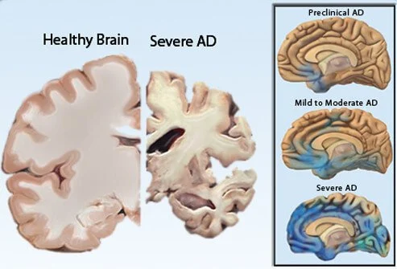

# Alzheimer-Disease-Data-Analysis
From Majid Feiz, Provided statistical analysis and hypothesis testing for various gene expressions for patients developing Alzheimer's disease.
**Project Status: Completed**
 
<a href="https://github.com/majfeizatgmaildotcom/Alzheimer-Disease-Data-Analysis/blob/a7bb3f15205f67d340722b9bb6ef9e0850e198c5/Alzheimer%20Disease_Part1.ipynb">Dashboard Python Viewer Part I </a> \
<a href="https://github.com/majfeizatgmaildotcom/Alzheimer-Disease-Data-Analysis/blob/a7bb3f15205f67d340722b9bb6ef9e0850e198c5/Alzheimer%20Disease%20Part2.ipynb">Dashboard Python Viewer Part II </a>\
<a href="https://github.com/majfeizatgmaildotcom/Alzheimer-Disease-Data-Analysis/blob/a7bb3f15205f67d340722b9bb6ef9e0850e198c5/Alzheimer%20Disease%20Part3.ipynb">Dashboard Python Viewer Part III </a>

## Project Objective
This project investigated the statistical distribution and correlation of various gene expression levels for the Dementia group and the Non-Dementia group for both males and females. Various t-Test analyses were performed for both males and females to investigate if the mean values of gene expression between the Dementia group and Non-Dementia group among female (and male) patients are different

## Dataset
<a href= "https://www.ncbi.nlm.nih.gov/geo/query/acc.cgi?acc=GSE44768"> Dataset link</a>
